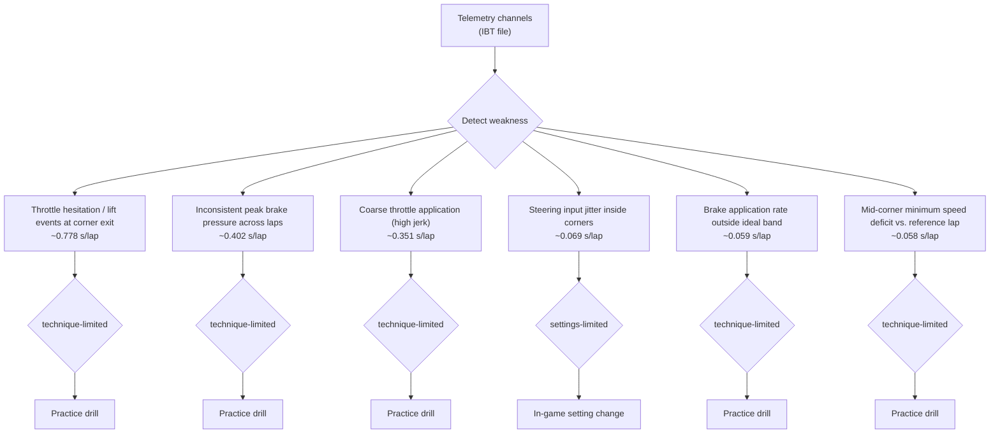

# iRacing Telemetry Analysis

- **Driver**: Juarez (1500 iR, target: consistent improvement to reach high level)
- **Car**: Porsche 911 GT3 R (992)
- **Track**: Road Atlanta
- **Hardware**: Simagic Alpha Ultimate (18.0 Nm DD) + Simagic P2000 (hydraulic)
- **Laps analyzed**: 11 valid
- **Reference lap**: 83.583s (lap 9)
- **Source**: `/root/.claude/uploads/e7f4ec93-58c5-49b2-8ad2-c2c91f1d80ee/d20ba2a0-porsche992rgt3_roadatlanta_full_20260506_204256.ibt.zip`

## Summary
- **Top weakness**: Throttle hesitation / lift events at corner exit — ~0.778s/lap (technique-limited)
- **Hardware verdict**: your current hardware is not the bottleneck
- **Key setting change**: Force Feedback Damping → 5-10% on DD wheels (start at 5; increase by 1 until jitter quiets)
- **Top drill**: Commit-To-One Throttle

## Channel Inventory
| Channel | Unit | Available |
|---|---|---|
| `Speed` | m/s | ✅ |
| `Brake` | % | ✅ |
| `Throttle` | % | ✅ |
| `Lap` |  | ✅ |
| `SteeringWheelAngle` | rad | ✅ |
| `LapDist` | m | ✅ |
| `LateralAccel` | — | ❌ |
| `OnPitRoad` |  | ✅ |
| `LapLastLapTime` | s | ✅ |
| `BrakeRaw` | % | ✅ |
| `Gear` |  | ✅ |
| `RPM` | revs/min | ✅ |

_Missing optional channels: LateralAccel, LongitudinalAccel._ Affected metrics are flagged inline as **[CHANNEL UNAVAILABLE — inferred]**.

## 1. Telemetry Diagnostic
Weaknesses ranked by estimated lap-time cost (highest first):

### 1. Throttle hesitation / lift events at corner exit
- **Estimated cost**: ~0.778s/lap
- **Metric value**: 97.2727 blips/lap
- **Cost math**: `0.008s × 97.3 blips/lap [HEURISTIC]`
- **Channels used**: `Throttle`
- **Root cause**: **technique-limited** — Hesitation / coarse throttle = driver second-guessing. Drill: commit to one throttle application per corner; if it doesn't work, change line, not throttle.

### 2. Inconsistent peak brake pressure across laps
- **Estimated cost**: ~0.402s/lap
- **Metric value**: 0.2999 coefficient of variation
- **Cost math**: `(CV=0.300 - 0.07) × 0.25 × 7 corners [HEURISTIC] (worst: T1 CV=0.448)`
- **Channels used**: `Brake`
- **Worst corners**: T1
- **Root cause**: **technique-limited** — Pedals (Simagic P2000 / hydraulic) already eliminate sensor noise. Inconsistency is in the foot — driver pressure modulation.

### 3. Coarse throttle application (high jerk)
- **Estimated cost**: ~0.351s/lap
- **Metric value**: 0.0400 jerk score
- **Cost math**: `(jerk=0.0400 - 0.015) × 2.0 × 7 corners [HEURISTIC]`
- **Channels used**: `Throttle`
- **Root cause**: **technique-limited** — Hesitation / coarse throttle = driver second-guessing. Drill: commit to one throttle application per corner; if it doesn't work, change line, not throttle.

### 4. Steering input jitter inside corners
- **Estimated cost**: ~0.069s/lap
- **Metric value**: 0.0397 rad RMS
- **Cost math**: `(jitter_rms=0.0397 - 0.015) × 0.4 × 7 corners [HEURISTIC]`
- **Channels used**: `SteeringWheelAngle`
- **Root cause**: **settings-limited** — DD wheel hardware is not the bottleneck — investigate FFB Damping/Smoothing settings and check for FFB clipping in the iRacing Black Box.

### 5. Brake application rate outside ideal band
- **Estimated cost**: ~0.059s/lap
- **Metric value**: 7.9735 %/100ms
- **Cost math**: `slow brake onset: (7.0% deficit) × 0.0012s × 7 corners [HEURISTIC]`
- **Channels used**: `Brake`
- **Root cause**: **technique-limited** — Slow brake onset = driver not 'stabbing' the pedal at threshold. Drill: practise threshold braking with target peak achieved within 200ms.

### 6. Mid-corner minimum speed deficit vs. reference lap
- **Estimated cost**: ~0.058s/lap
- **Metric value**: 0.0576 seconds/lap
- **Cost math**: `sum(-Δv × d / v²) across matched corners [PHYSICS-BASED]`
- **Channels used**: `Speed`, `LapDist`
- **Worst corners**: T3, T1, T4
- **Root cause**: **technique-limited** — Mid-corner speed is the sum of entry, line, and trust. Address by working on trail-braking and a later, slower turn-in to carry rotation.

## 2. Hardware Recommendation
**Verdict: your current hardware is not the bottleneck.** The Simagic Alpha Ultimate delivers 18.0 Nm DD, and the Simagic P2000 (hydraulic) eliminates the load-cell-vs-potentiometer noise problem that limits entry-level rigs. Every diagnosed weakness in this session traces to technique or in-game settings.

Counter-argument: a higher-torque wheel could in theory deliver more detail near the limit, but the telemetry shows no signal that the hardware is masking driver intent. Spend the money on iRacing subscriptions and coaching instead.

## 3. In-Game Configuration
### Force Feedback Strength
- **iRacing path**: `Black Box (F9 in-car) > Force Feedback > 'Auto' button`
- **Recommended**: Use 'Auto' once per car after 1-2 hot laps; verify the bar is not flashing red
- **Why**: With a 18 Nm DD wheel, hand-tuning FFB strength risks clipping on high-grip cars. iRacing's Auto sets max torque without clipping, which is the correct ceiling for a DD wheel.
- **Source**: iRacing Member Forums — David Tucker FFB documentation
- **Risk**: settings changes feel different immediately; do not chase lap time in the first session after changing them — focus on consistency.

### Force Feedback Damping
- **iRacing path**: `Options > Drive > Force Feedback > Damping`
- **Recommended**: 5-10% on DD wheels (start at 5; increase by 1 until jitter quiets)
- **Why**: Damping suppresses high-frequency oscillations the DD motor amplifies. With Simagic Alpha class hardware, do NOT exceed 10% or the wheel will feel laggy.
- **Source**: iRacing Member Guide; Boosted Media FFB Setup Guide
- **Risk**: settings changes feel different immediately; do not chase lap time in the first session after changing them — focus on consistency.

### Min Force
- **iRacing path**: `Options > Drive > Force Feedback > Min Force`
- **Recommended**: 0%
- **Why**: DD wheels have no deadzone; Min Force only helps belt/gear wheels.
- **Source**: iRacing Member Forums
- **Risk**: settings changes feel different immediately; do not chase lap time in the first session after changing them — focus on consistency.

### Smoothing
- **iRacing path**: `Options > Drive > Force Feedback > Smoothing`
- **Recommended**: 0
- **Why**: Smoothing destroys the road texture that DD hardware exists to deliver.
- **Source**: Boosted Media FFB Setup Guide
- **Risk**: settings changes feel different immediately; do not chase lap time in the first session after changing them — focus on consistency.

### Brake Force Factor
- **iRacing path**: `Options > Drive > Pedals > Brake Force Factor (or Brake Calibration)`
- **Recommended**: 1.0 (linear); set max-pressure point so 100% brake = comfortable peak press
- **Why**: Simagic P2000 reports real pressure. Anything other than linear hides what the pedal is actually doing.
- **Source**: iRacing Custom Brake App documentation
- **Risk**: settings changes feel different immediately; do not chase lap time in the first session after changing them — focus on consistency.

### Brake Linearity Lookup Table (LUT)
- **iRacing path**: `Documents/iRacing/braketable.txt (custom .lut) or Options > Drive > Pedals`
- **Recommended**: Generate a per-driver brake LUT using the iRacing Custom Brake App
- **Why**: When brake-pressure consistency is the problem on hydraulic pedals, a LUT mapping raw pressure → game-brake response gives the driver a more linear feel and lets them hit the same peak repeatedly.
- **Source**: iRacing Custom Brake App documentation
- **Risk**: settings changes feel different immediately; do not chase lap time in the first session after changing them — focus on consistency.

### Steering Wheel Range (per car)
- **iRacing path**: `Options > Drive > Steering Wheel: 'Auto' + verify with car's actual lock`
- **Recommended**: Auto — let iRacing match game lock to the car (~480° for Porsche GT3 R)
- **Why**: Locking the wheel to the car's actual steering range means 1:1 visual feedback. Mid-corner speed deficits often trace to mismatched wheel ratio.
- **Source**: iRacing Member Guide
- **Risk**: settings changes feel different immediately; do not chase lap time in the first session after changing them — focus on consistency.

### Look Ahead / Head Movement
- **iRacing path**: `Options > Graphics > Driving View > Look Ahead`
- **Recommended**: 1.5-2.0 seconds (start at 1.5)
- **Why**: Carrying mid-corner speed requires eyes on the exit, not the apex. Increased look-ahead forces the camera to anticipate, which trains the driver's eyes.
- **Source**: Coach Dave Academy — Vision and Look-Ahead Training
- **Risk**: settings changes feel different immediately; do not chase lap time in the first session after changing them — focus on consistency.

## 4. Practice Plan
### Drill 1: Commit-To-One Throttle
- **Addresses**: Throttle hesitation / lift events at corner exit
- **What to do**: Force yourself to make ONE throttle application per corner exit — no lifts, no re-applications. If the car oversteers, accept the slide and use it, or pick a different line next lap. The fix is line/entry, not throttle hesitation.
- **Success criterion**: <1 throttle blip per lap on average.
- **Session format**: 10-lap solo practice
- **Monitor**: `Throttle signal during corner exit`

### Drill 2: Threshold Braking Consistency
- **Addresses**: Inconsistent peak brake pressure across laps
- **What to do**: Pick one heavy-braking corner. Set a target peak brake pressure (e.g. 85%). Run 15 laps. Goal: hit ±3% of that target every single lap. Do not chase lap time.
- **Success criterion**: Brake peak-pressure CV at the target corner < 0.07 across 10 consecutive laps.
- **Session format**: 15-lap solo practice, identical fuel/tyre conditions
- **Monitor**: `Brake peak pressure per corner`

### Drill 3: Roll-On Throttle Ramp
- **Addresses**: Coarse throttle application (high jerk)
- **What to do**: From apex, target a constant rate of throttle increase (e.g. 0 → 100% over 1.5 seconds). Use a metronome app set to ~80 BPM as a mental pacer. The goal is no spikes, no flats.
- **Success criterion**: Throttle jerk score < 0.015.
- **Session format**: 10-lap solo practice
- **Monitor**: `Throttle 2nd-derivative (jerk proxy)`

## Decision Flow

## Notes

- Heuristic lap-time costs labeled `[HEURISTIC]` are approximations, not measurements. Use them to order priorities, not to set targets.
- Physics-based costs (corner speed delta) are first-order kinematic estimates assuming constant corner length; actual gains depend on the rest of the lap holding constant.
- Re-run analysis after one practice session per drill to validate improvement.